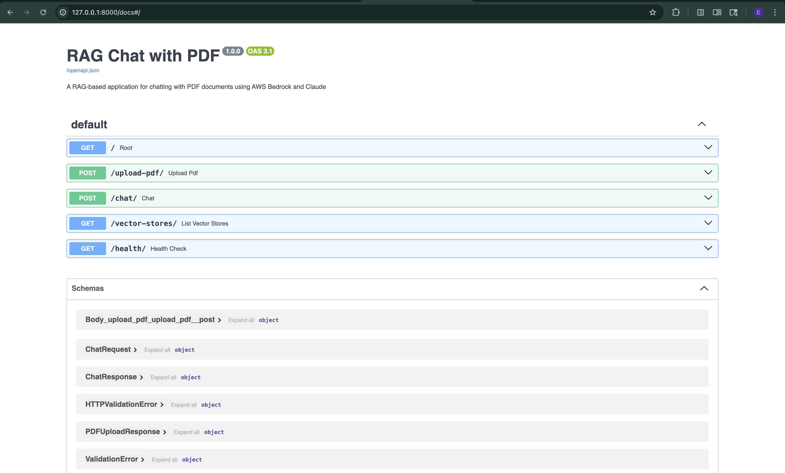
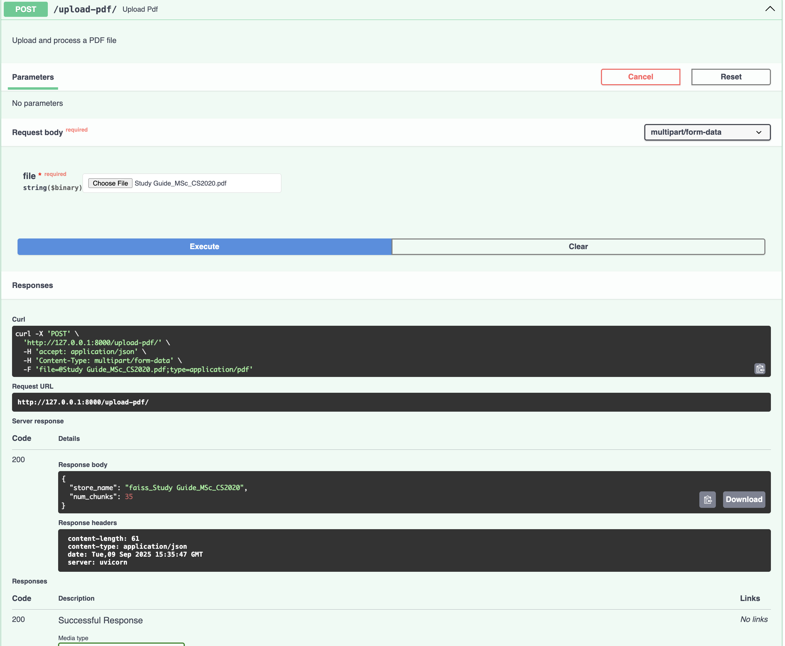
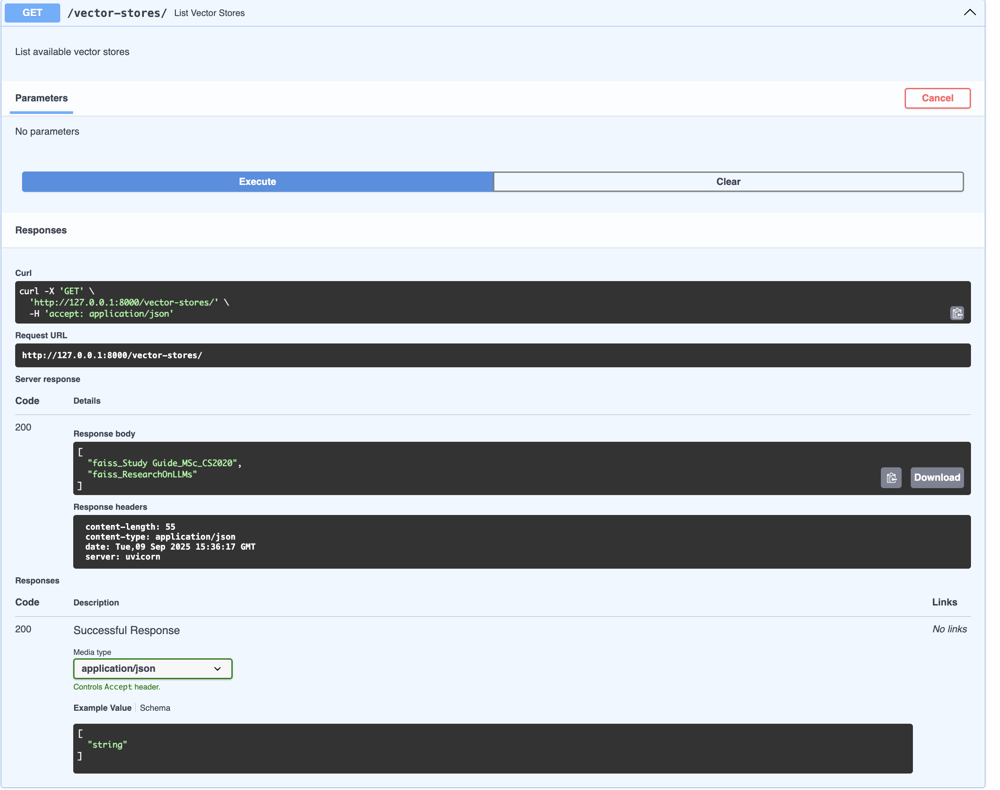
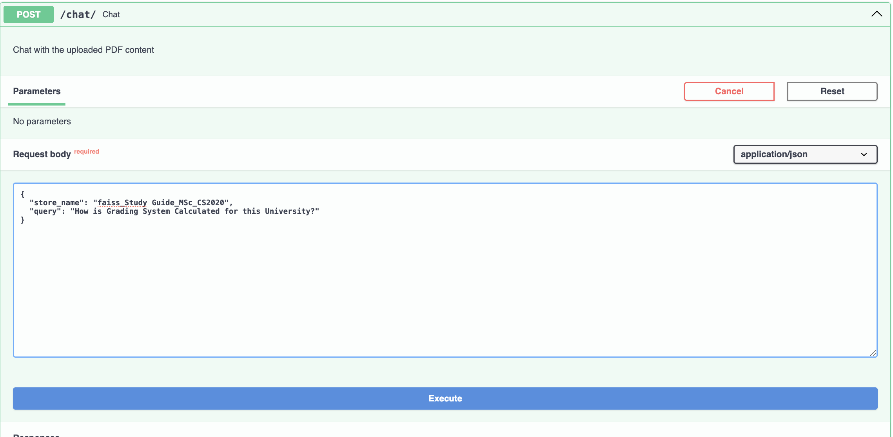
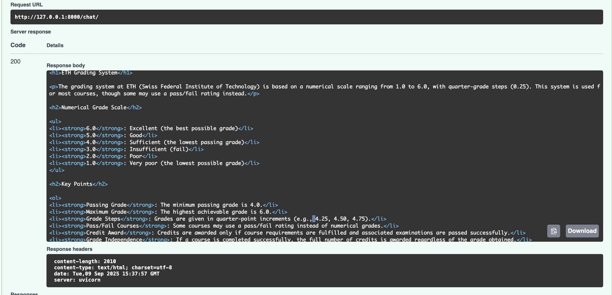
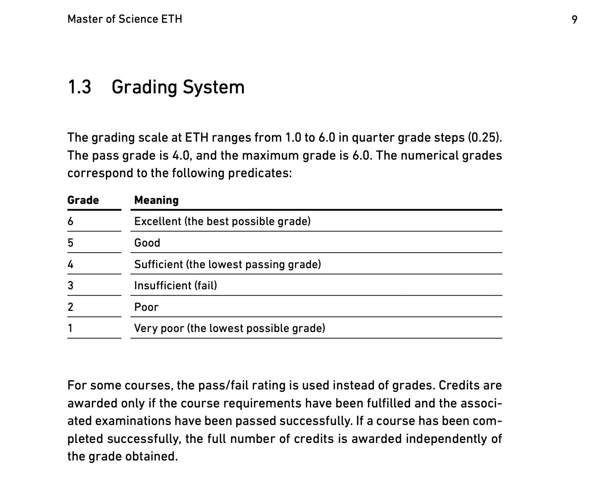

# Bedrock-Chat-With-PDF

This project demonstrates a Retrieval-Augmented Generation (RAG) pipeline built using FastAPI, AWS Bedrock, Titan Embeddings, Claude (Sonnet), and FAISS.

## It allows you to:

1. Upload a PDF 📑
2. Automatically process it into text chunks ✂️
3. Store those chunks as vector embeddings in a FAISS index 🔍
4. Ask natural language questions about the PDF ❓
5. Get context-aware answers generated by Claude with Markdown formatting 📝

## Features

- FastAPI backend for speed and simplicity.
- AWS Bedrock for accessing foundation models securely.
- Amazon Titan v2 embeddings for text vectorization.
- FAISS for efficient similarity search (retrieving relevant chunks).
- Anthropic Claude Sonnet 3.5 for context-grounded generation.
- Responses are returned in Markdown, easily convertible to HTML for UI rendering.
- Health-check, vector store listing, and modular class-based code for maintainability.

## Architecture

PDF Upload
- Extract text with PyPDF2.
- Split into overlapping chunks (RecursiveCharacterTextSplitter).

Vectorization
- Each chunk is converted to embeddings with Titan v2 via Bedrock.
- Stored in FAISS for fast vector search.

Querying
- Retrieve top-k relevant chunks from FAISS.
- Construct a context-aware prompt for Claude.
- Claude generates a detailed Markdown answer with references to the provided context.

## Screenshots
- FastAPI Backend

- You can Upload any PDF

- Post uploading PDF your vector stores will be visible
  

- Update your chat request with your query and vector store
  

- Bingo, here's your response from the LLM using your PDF as a knowledge base
  

- And here's the PDF context related to the question. You could see the similar response the LLM has retrieved from the PDF at this specific location.
  

This shows you:
- Hands-on capability in LLM app development with real-world stack (Bedrock + FastAPI).
- Clear end-to-end pipeline: data ingestion → embeddings → vector DB → LLM generation.
- Flexible enough to be extended with authentication, UI, or multi-document search.
- Built with enterprise-readiness in mind (modular code, class-based services, persistence).
